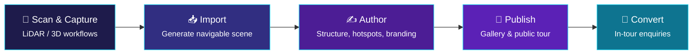
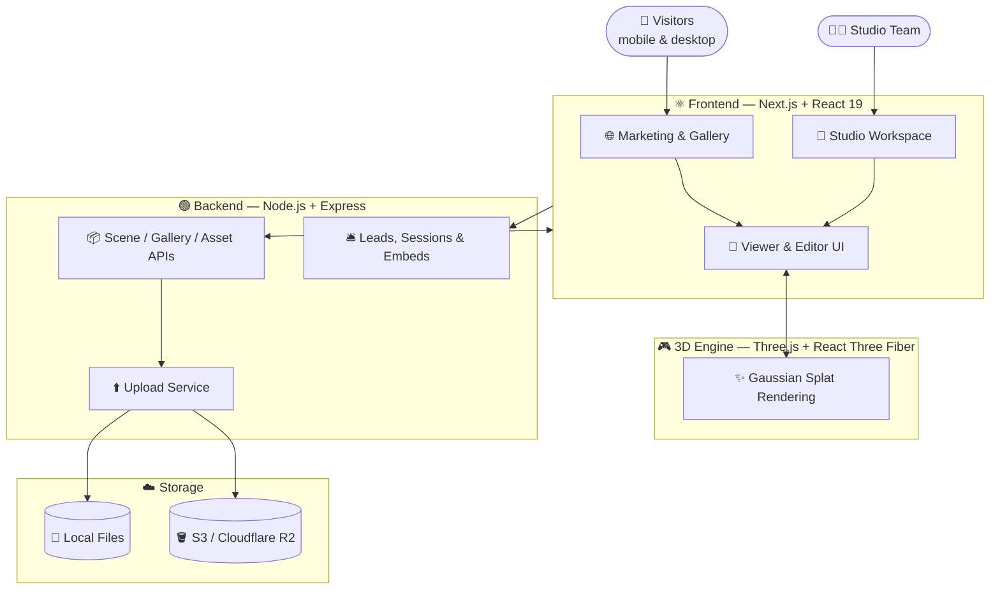

<div align="center">


<br/>


<br/><br/>

<b>Immersive 3D digital-twin experiences, curated studio workflows, and public virtual tours built for modern property marketing and spatial storytelling.</b>

<br/><br/>

<a href="#-overview">Overview</a> •
<a href="#-core-features">Features</a> •
<a href="#%EF%B8%8F-architecture">Architecture</a> •
<a href="#-repository-structure">Structure</a>

</div>


## ✨ Overview

**Three-D-GS Platform** is a full-stack solution for creating, managing, and publishing immersive 3D spaces from real-world locations. It blends a marketing website, a private studio/editor, and a scalable backend API to transform captured spaces into browser-based tours.

> [!TIP]
> **No app installations required** — visitors explore directly on mobile or desktop browsers.

<!-- 🎬 Tip: record a short walkthrough of a live tour (ScreenToGif / Kap / OBS → GIF),
     save it as docs/demo.gif, then uncomment the block below. -->
<!--
<div align="center">
  
</div>
-->

### 🔄 The Capture-to-Publish Workflow



1. 📡 **Scan & Capture:** Walk the real site and collect spatial data using LiDAR or 3D workflows.
2. 📥 **Import:** Upload the spatial data into the studio to generate a navigable scene.
3. ✍️ **Author:** Set the tour structure, metadata, interactive viewpoints, and branding.
4. 🚀 **Publish:** Push the space to the public gallery and virtual tour experience.
5. 🤝 **Convert:** Visitors explore the space and submit enquiries from inside the tour.


## 🎯 Why This Platform Matters

Passive image galleries don't convert like they used to. This platform is built for spaces where people need to **explore before they decide**:

<div align="center">

| 🏨<br/>**Hospitality & Hotels** | 🎓<br/>**Colleges & Campuses** | 🏛️<br/>**Heritage Spaces** | 🏢<br/>**Commercial Offices** | 🔬<br/>**Labs & Facilities** |
|:---:|:---:|:---:|:---:|:---:|

</div>

*Instead of looking at photos, visitors can walk through a property and send enquiries without ever leaving the room.*


## 🌟 Core Features

| Feature | Description |
| :--- | :--- |
| 🧭 **Virtual Tours** | Gaussian-splat tours in the browser. Features include Walk, Fly, Orbit, camera tracks, and a live floor map with a "you are here" indicator. |
| 📍 **Smart Hotspots** | Embed text, images, video, audio, links, portals, and tables. Set them to always show, or reveal dynamically as visitors approach. |
| 🌗 **Day / Night Mode** | Toggle a night version of a space in one tap without losing the current view. |
| 🌐 **Multilingual** | Native support for English, नेपाली, and 中文 (via picker or `?lang=`). |
| 🍽️ **Table Booking** | Interactive floor plans with GSAP animations. Guests pick tables; the studio manages approvals via the reservations inbox. |
| 🛎️ **Lead Generation** | Built-in booking cards per space and in-tour enquiry panels to capture visitor intent. |
| 🖥️ **Client Websites** | Full dedicated sites at `/s/<project>`. Includes live tours, menus, bookings, contact forms, and draft/publish controls. |
| 🎨 **Auto-Branding** | Upload a logo and the system suggests brand colors. Custom fonts and branding info per project. |
| 🧑‍💼 **Studio Workspace** | Powerful scene editor, version history, activity logging, and granular team roles. |
| 📊 **Analytics** | Monthly visitor reports, exportable floor-plan PDF sheets, and CSV enquiry exports. |
| ☁️ **Cloud Storage** | Native integration for S3-compatible buckets (Cloudflare R2) to synchronize splat data across machines. |

> [!NOTE]
> 📚 **Full Feature Book:** Check out the detailed guide in [`docs/RCAAS-Feature-Book.pdf`](docs/RCAAS-Feature-Book.pdf).


## 🏗️ Architecture



### Frontend Layer
Powered by **Next.js** and **React 19** to deliver:
* Public marketing pages & Gallery experiences.
* The secure, authenticated Studio workspace.
* A highly responsive viewer and editor UI.

### Backend & API Layer
Built on **Node.js** and **Express.js** to manage:
* Scene, gallery, and asset APIs.
* Upload services (Local or S3/Cloudflare R2).
* Lead submission, session controls, and embed support.

### 3D Rendering Engine
Built around **Three.js** and **React Three Fiber** for hyper-smooth real-time spatial rendering, Gaussian splatting, and immersive web interactions.


## 🧱 Repository Structure

<details>
<summary><b>Click to expand</b></summary>

```text
.
├── docs/                      # Feature book (PDF)
├── public/                    # Static media, sample assets, and site files
├── scripts/dev.mjs            # Starts the site and the API together
├── server/                    # Express API and file-backed storage layer
│   ├── src/                   # Routes, storage.js (local), storage-s3.js (S3/R2)
│   └── scripts/               # push-assets.js (`npm run assets:push`)
├── src/
│   ├── app/                   # Next.js App Router pages
│   ├── components/            # UI, editor, viewer, and 3D scene components
│   └── lib/                   # 3D game/navigation logic, API, and upload helpers
├── test/                      # Frontend test coverage
└── package.json               # Root dependencies and workspace scripts
```

</details>

<div align="center">

<br/>

**Explore before you decide. 🌐**


</div>
